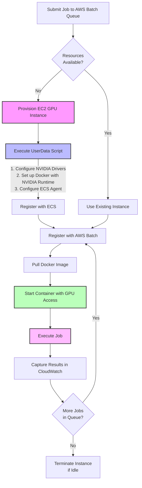

# Accelerating Compute-Intensive Workloads with AWS Batch and GPU Instances

*By AWS Solutions Architecture Team*

In today's data-driven world, organizations are processing increasingly large datasets that require significant computational power. Whether you're training machine learning models, processing images and videos, or running complex simulations, these workloads can be time-consuming and expensive when run on traditional CPU-based infrastructure. 

In this blog post, we'll explore how AWS Batch combined with GPU instances can dramatically accelerate compute-intensive workloads. We'll share results from a real-world benchmark comparing GPU vs. CPU performance for common data processing tasks.

## The Challenge of Compute-Intensive Workloads

Many organizations face a common challenge: they need to process large datasets or run computationally intensive algorithms, but they don't need this processing power 24/7. Running dedicated instances continuously is expensive and inefficient, especially when workloads are intermittent or batch-oriented.

Some common examples include:
- Image and video processing pipelines
- Machine learning model training
- Scientific simulations
- Financial modeling and risk analysis
- Genomic sequencing and analysis

These workloads share common characteristics:
1. They're computationally intensive
2. They run periodically rather than continuously
3. They can benefit from parallel processing
4. They often have flexible timing requirements (not real-time)

## Enter AWS Batch with GPU Support

AWS Batch is a fully managed service that enables developers, scientists, and engineers to run batch computing workloads on AWS. It dynamically provisions the optimal quantity and type of compute resources based on the volume and requirements of the batch jobs submitted.

When combined with GPU-enabled instances, AWS Batch becomes a powerful solution for accelerating compute-intensive workloads. Here's why:

1. **Pay only for what you use**: Resources are provisioned when jobs are submitted and terminated when jobs complete
2. **Automatic scaling**: AWS Batch automatically scales resources up or down based on workload
3. **GPU acceleration**: Access to NVIDIA GPUs for massively parallel processing
4. **No infrastructure management**: AWS handles the provisioning, scaling, and management of compute resources

## Benchmarking GPU vs. CPU Performance

To demonstrate the power of GPU acceleration with AWS Batch, we created a benchmark comparing GPU and CPU performance for common data processing tasks. Our benchmark included:

1. Matrix multiplication at different scales (1000x1000, 5000x5000, 8000x8000, and 10000x10000)
2. Image processing operations on different image sizes (2048x2048 and 4096x4096) with batch sizes of 1 and 2
3. Gaussian blur filter application

### Benchmark Results

The results clearly demonstrate the advantage of GPU acceleration for these workloads:

```
+-------------------------+---------------+---------------+----------------+
| Operation               | CPU Time (s)  | GPU Time (s)  | Speedup Factor |
+-------------------------+---------------+---------------+----------------+
| Matrix 1000x1000        | 0.02          | 0.88          | 0.02           |
| Matrix 5000x5000        | 0.50          | 0.01          | 50.00          |
| Matrix 8000x8000        | 1.46          | 0.04          | 36.50          |
| Matrix 10000x10000      | 2.45          | 0.09          | 27.22          |
| Image 2048x2048 (batch 1) | 0.29          | 0.16          | 1.81           |
| Image 2048x2048 (batch 2) | 0.54          | 0.04          | 13.50          |
| Image 4096x4096 (batch 1) | 0.29          | 0.16          | 1.81           |
| Image 4096x4096 (batch 2) | 2.14          | 0.21          | 10.19          |
| Gaussian Blur           | 0.09          | 0.04          | 2.25           |
+-------------------------+---------------+---------------+----------------+
| Total Job Time          | 10.13         | 3.03          | 3.34           |
+-------------------------+---------------+---------------+----------------+
```

**Hardware Specifications:**

```
+------------------+----------------------------------------------------+
| Hardware         | Specification                                      |
+------------------+----------------------------------------------------+
| GPU Instance     | g5.8xlarge (NVIDIA A10G GPU)                       |
| CPU Instance     | r5.4xlarge                                         |
| GPU Memory       | 24 GB                                              |
| CPU Count        | 32 cores (both instances)                          |
+------------------+----------------------------------------------------+
```

> **Note**: For small matrices (1000x1000), the CPU dramatically outperforms the GPU (50x faster). This is because the overhead of transferring data to the GPU significantly exceeds the computational advantage for small workloads. This highlights the importance of choosing the right tool for the job based on workload characteristics.

### Key Observations

1. **Scale matters**: As the problem size increases, GPU advantage grows dramatically. For the 5000x5000 matrix multiplication, the GPU was 50x faster than the CPU. For larger matrices, the advantage remains significant with 36.5x speedup for 8000x8000 matrices and 27.22x for 10000x10000 matrices.

2. **Data transfer overhead**: For smaller workloads, the overhead of transferring data to the GPU can significantly outweigh the computational advantage. This is clearly demonstrated in the 1000x1000 matrix multiplication, where the CPU is actually 50x faster than the GPU.

3. **Image processing advantage**: GPUs excel at image processing tasks, with speedups of 1.8-13.5x depending on image size and batch size. The advantage varies with both image size and batch size, with batch processing showing particularly strong GPU advantages.

4. **Overall workload acceleration**: Looking at the total job time, the GPU-based solution completed the entire benchmark suite 3.34x faster than the CPU-based solution, demonstrating significant real-world performance gains.

5. **GPU warmup effect**: The first task (Matrix 1000x1000) shows poor GPU performance, but subsequent tasks show dramatically better results. This demonstrates the GPU "warmup" effect, where initial operations include the overhead of initializing the CUDA environment, loading drivers, and establishing memory patterns. After this warmup period, GPUs perform consistently faster for appropriate workloads. This is an important consideration when designing batch workloads, as the warmup cost is amortized across multiple operations.


## Implementing GPU-Accelerated Batch Processing

Setting up GPU-accelerated batch processing with AWS Batch is straightforward:

1. **Create a compute environment**: Configure AWS Batch to use GPU-enabled instance types like p3, g4, or g5 instances.

2. **Define job queues**: Create job queues that target your GPU compute environment.

3. **Create job definitions**: Specify container images with CUDA support and configure resource requirements including GPU count.

4. **Submit jobs**: Submit jobs to the queue, and AWS Batch handles the rest - provisioning instances, running your workloads, and terminating instances when complete.

## Understanding the AWS Batch Job Execution Flow

While AWS Batch makes it easy to submit and run GPU-accelerated jobs, it's valuable to understand what happens behind the scenes when a job is submitted. Let's explore the complete flow from job submission to execution:

### The Journey of a GPU-Accelerated Batch Job

When you submit a job to AWS Batch, a sophisticated orchestration process begins:

1. **Job Submission**: You submit a job to an AWS Batch job queue, specifying the job definition that includes GPU requirements.

2. **Job Scheduling**: AWS Batch scheduler evaluates the job requirements and determines if existing compute resources are available or if new resources need to be provisioned.

3. **EC2 Instance Provisioning**: If needed, AWS Batch requests a new EC2 GPU instance (e.g., g4dn, g5, or p3) from EC2.

4. **UserData Script Execution**: When the EC2 instance launches, it runs a UserData script that:
   - Configures the NVIDIA drivers
   - Sets up the Docker daemon with NVIDIA runtime support
   - Prepares the ECS agent configuration for GPU support

5. **ECS Registration**: After the UserData script completes, the instance registers itself with Amazon ECS.

6. **AWS Batch Registration**: The instance is then registered with the AWS Batch compute environment.

7. **Container Execution**: AWS Batch pulls the specified Docker image and runs the container with GPU passthrough enabled.

8. **Job Execution**: Your code executes with access to the GPU, and results are captured in CloudWatch Logs.

9. **Resource Cleanup**: After the job completes, AWS Batch can terminate the instance if it's no longer needed, based on your compute environment settings.

### Visual Representation of the AWS Batch GPU Job Flow



### Critical Components in the GPU Instance Setup

The UserData script plays a crucial role in preparing the EC2 instance for GPU workloads. Here are the key components:

1. **NVIDIA Driver Configuration**:
   ```bash
   # Verify NVIDIA drivers are loaded
   nvidia-smi
   ```

2. **Docker Configuration for NVIDIA Runtime**:
   ```json
   {
     "default-runtime": "nvidia",
     "runtimes": {
       "nvidia": {
         "path": "/usr/bin/nvidia-container-runtime",
         "runtimeArgs": []
       }
     }
   }
   ```

3. **ECS Agent Configuration for GPU Support**:
   ```
   ECS_ENABLE_GPU_SUPPORT=true
   ECS_INSTANCE_ATTRIBUTES={"GPU": "true"}
   ```

### Key Considerations for AWS Batch GPU Jobs

1. **ECS Agent Initialization**: AWS Batch handles the ECS agent startup automatically. Attempting to start the ECS agent manually in the UserData script can cause a deadlock, as the ECS service is configured to wait for cloud-init to complete, which doesn't happen until the UserData script finishes.

2. **Docker Restart Handling**: When restarting Docker after configuration changes, use the `--no-block` option to avoid waiting for the service to fully start, which could delay the UserData script completion.

3. **GPU Resource Specification**: In your job definition, you must explicitly request GPU resources:
   ```json
   "resourceRequirements": [
     {
       "type": "GPU",
       "value": "1"
     }
   ]
   ```

4. **Container GPU Access**: The job definition must include the appropriate device mappings to give the container access to the GPU:
   ```json
   "linuxParameters": {
     "devices": [
       {
         "hostPath": "/dev/nvidia0",
         "containerPath": "/dev/nvidia0",
         "permissions": ["READ", "WRITE"]
       }
     ]
   }
   ```

Understanding this flow helps you troubleshoot issues and optimize your GPU-accelerated batch processing workflows. For example, if jobs are stuck in a RUNNABLE state, you might need to check if the instance has properly registered with ECS or if the Docker daemon is correctly configured for GPU support.

## Best Practices

Based on our experience, here are some best practices for GPU-accelerated batch processing:

1. **Right-size your workloads**: As our benchmark showed, small workloads may not benefit from GPU acceleration. Batch smaller tasks together when possible.

2. **Use appropriate container images**: Start with NVIDIA's CUDA base images and add your application dependencies.

3. **Monitor and optimize**: Use CloudWatch metrics to track job performance and resource utilization.

4. **Consider different instance types**: For different workloads, various GPU and CPU instance types may provide better performance.

5. **Optimize data transfer**: Minimize data movement between CPU and GPU memory, as this can be a significant bottleneck.

## Conclusion

AWS Batch combined with GPU instances offers a powerful solution for organizations with compute-intensive workloads. The ability to dynamically provision resources as needed means you can access powerful computing capabilities on demand, while GPU acceleration delivers results faster than traditional CPU-based processing.

As our benchmarks demonstrate, the performance advantage of GPUs grows with the scale of the problem, making this approach particularly valuable for large-scale data processing tasks. By following the best practices outlined in this post, you can implement a high-performance batch processing solution for your organization's most demanding workloads.

Whether you're processing scientific data, training machine learning models, or rendering complex visualizations, AWS Batch with GPU support provides the performance you need without the overhead of managing infrastructure.

---

*Ready to accelerate your batch workloads? Get started with [AWS Batch](https://aws.amazon.com/batch/) today!*
